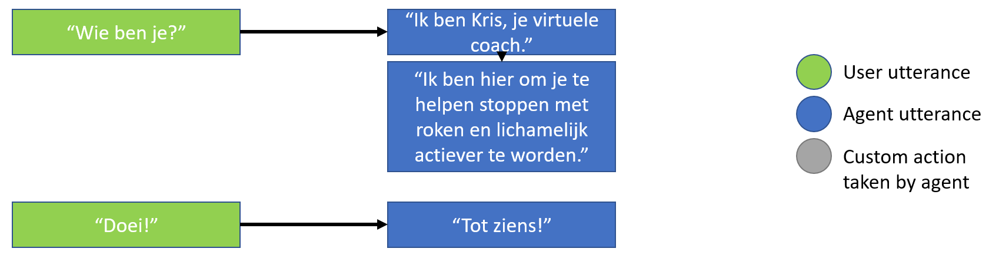
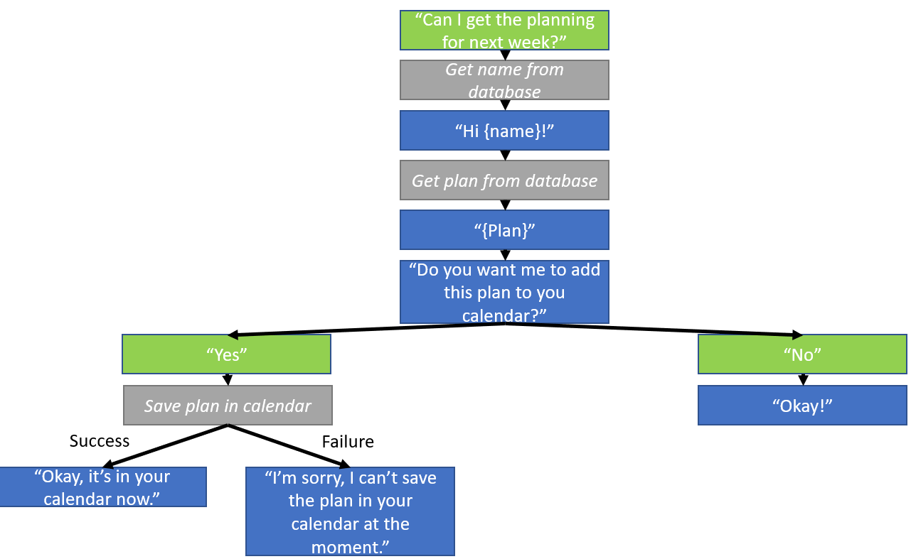
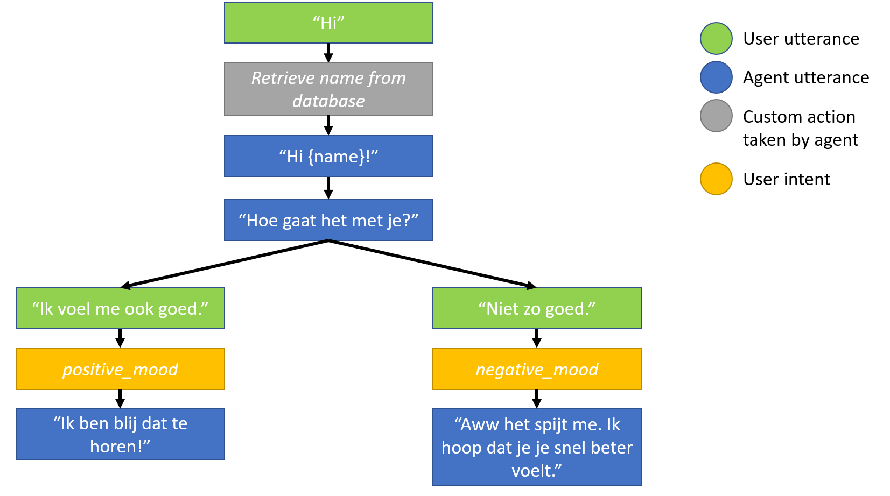
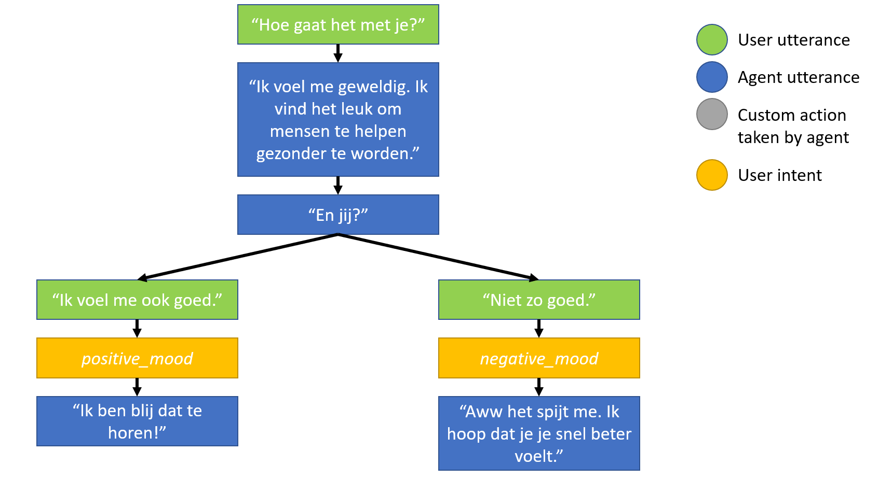

This is a simple conversational agent implemented in Rasa 3.0.5 with a Dutch language model.

## How to Run
To run the full application, see [virtual-coach-main](https://github.com/PerfectFit-project/virtual-coach-main)

These are instructions to run rasa bot in isolation.

See here for the instructions from Rasa: https://rasa.com/docs/rasa/docker/deploying-in-docker-compose/.

The steps are as follows:
- Make sure that you have Docker and Docker Compose installed. You can check whether you do by typing `docker -v && docker-compose -v`.
- Start the database via docker-compose, apply the existing migrations and load test data (see [here](https://github.com/PerfectFit-project/virtual-coach-db).
- Create a .env-file in the Rasa_Bot/actions-folder that contains the host address and port of the running database in the variable DB_HOST. If the database is running on localhost on Windows or Mac and you want to access it from inside a Docker container, set DB_Host to host.docker.internal:<port_number> (see .env-example).
- Navigate to the "Rasa_Bot"-folder on your laptop.
- Type `docker-compose up`.
- Now you can communicate with the bot via its REST API. E.g. on Windows, type `curl http://localhost:5005/webhooks/rest/webhook -d "{\"message\": \"Kan ik de agenda voor de week krijgen?\", \"sender\":\"user\"}"`. Note that the escaping of the double-quotes is a fix that is needed on Windows.
   - The output for the above command should be something like this: [{"recipient_id":"user","text":"Sure, you should ..."}]
   - See [this page](https://rasa.com/docs/rasa/connectors/your-own-website#restinput) for details on how to use the REST channel.

Note that while the requirements-file lists Rasa 3.0.5 as a requirement, this is only needed to train a language model and handy when developing.

NB: If you want to run rasa outside of docker, you might want to change the urls
in `endpoints.yml`.

## Future Changes
### Language
We now use spacy language embeddings, and we removed entity recognition from the pipeline. Let's keep an eye on whether we want to keep doing this.

### Rasa Version
Currently, the model is trained in Rasa 3.0.5. Different Rasa versions are not necessarily compatible w.r.t. e.g. layout of the language model files, so we should eventually choose a specific Rasa version, probably the most current one. See [here](https://rasa.com/docs/rasa/changelog) for the changelog for Rasa Open Source. 

### Agent Name
The agent name is set in the "domain.yml"-file in the slot "agent_name." Changing this name in said file requires retraining the model. 

### Storage of Conversations
All conversations are stored in memory, which means that they are lost once the Rasa server is restarted. It is possible to set up a tracker store so that the conversations persist. See [this page](https://rasa.com/docs/rasa/tracker-stores) for more information.

## Conversation Flow
The agent is built for very simple conversations. It's capabilities are twofold. First, it will always respond according to the rules shown below. For example, it will always respond with a goodbye-message if the user sends a goodbye-message.

Secondly, the agent is trained for three simple conversations. One is about the weekly planning, one is about the agent's mood, as asked about by the user, and one is about a greeting, initiated by the user.

The timeout is currently set to 5 minutes (in the "domain.yml"-file). This is the period of time after which the agent assumes that the current conversation is over. Sending a message from the user after this timeout period has passed then starts a new conversation. A new conversation can also explicitly be started by sending the message "/restart".

## Components

- actions
   - actions.py: custom actions, e.g. for reading from a database or file.
   - requirements-actions.txt: requirements for the custom action code to be installed in the Docker container for the custom actions.
- data:
   - nlu.yml: contains the intents that the agent can recognize and training examples for each such intent. We have intents e.g. for a positive mood, for confirming, and for requesting the weekly planning.
   - rules.yml: rules override actions predicted based on stories. We currently use them to e.g. always say bye back after the user says goodbye. There is also a fallback rule for low NLU confidence.
   - stories.yml: training stories, i.e. the conversation paths the agent can take.
- models: contains trained models
- domain.yml: contains all slots, utterances, etc. Also defines the time period after which a new conversation starts in case of inactivity.
- config.yml: sets the training configuration for rasa core (e.g. which policies to use, what the fallback should be when the agent is not sure what the next action should be, ...), the threshold for low NLU confidence (the threshold for the FallbackClassifier), etc.

## Tips for developers

### Add dependencies for action server to requirements
In case the new custom action code requires any libraries, these need to be added to "requirements-actions.txt" in the "actions"-folder.

### Spacy language embeddings 
We now use spacy language embeddings (specified in config.yml). To train the model, you now need to have spacy installed as well as the Dutch language model that we use. Have a look [here](https://spacy.io/usage) for how to install spacy.

### Retraining when making changes to Language Model
Any changes made to domain.yml, nlu.yml, config.yml, stories.yml, among others, require retraining the model via `rasa train`. It is important to pay attention to the Rasa version that is used for this training. If the Rasa version is changed, then the Rasa SDK version in the Dockerfile and the Rasa version in the docker-compose.yml file also need to be updated.
