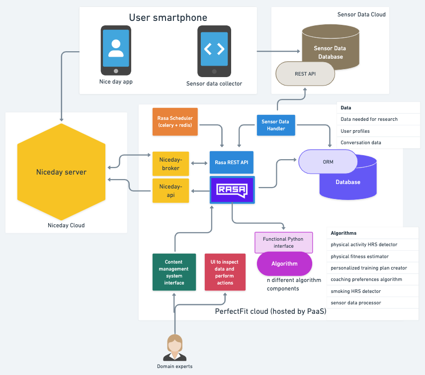

# Design (v2.2) PerfectFit Virtual Coach system
The general goal of PerfectFit is to Develop an eCoach app that will provide personalised assistance on smoking cessation 
and increasing physical activity based on personal (sensor) data 
(read more [here](https://www.research-software.nl/projects/583)).

This document describes the intended architecture for the eCoach.

---

## Non-functional requirements
* **No need for scalability**. We expect max 500 participants for the research that will be conducted with the system,
thus probably only max 50 users simultaneously using the app.
Scalability is nice-to-have for generalisation of the system, but not critical.
* **Privacy & Security**. Sensitive data such as sensor data and conversations will flow through the app.
Privacy and security are critical.
* **No need for high performance**. Unless it results in an awful user experience
* **Generalization**. We want the virtual coach system as well as individual components to be reusable outside of the
PerfectFit project. So individual components should be modular, and Niceday should be swappable with any other chat
framework.

## Functional requirements
See [this overview](https://nlesc.sharepoint.com/:x:/s/team-flow/EUCPwrKzPY1BikrYk_BDhCcB8vBLgsI-xsT63dedExPQaA?e=GlfxeO)

---

## Architecture sketch

See it also on [whimsical](https://whimsical.com/perfectfit-UtvRnxdP8P79humXTnjb9J)

---
## Components
### Smartphone applications
#### Niceday app (already developed)
The user interacts with the
[NiceDay smartphone app](https://play.google.com/store/apps/details?id=nl.sense.goalie2&hl=nl&gl=US).
This app is developed by [sense-health](https://sense-health.com/) which is part of the consortium.

Its main features are:
* Trackers: simple panels that track amongst others: mood, number of cigarettes smoked, step count, thought records.
* Daily planner: overview of planned actions
* Messaging

#### Sensor data collection app (out of scope)
A separate app for collecting sensor data that is needed to estimate physical capacity.
* The Niceday app itself cannot gather this data.
* At the start of an activity the sensor data collector is triggered to start recording sensor data.
* After an activity or upon Wifi connection the data is pushed to the Sensor Data Database.
* Data is exposed by a REST API
* Will be based on an existing app and developed outside of scope of PerfectFit
virtual coach system.
---

### Niceday components
#### Niceday server (already developed)
* Backend for the Niceday app.
* Data storage:
  - user profile data,
  - app-interaction data
  - messages
* Handles user authentication

---
### PerfectFit virtual coach system components
We cannot change much in the NiceDay app, new PerfectFit features will be implemented
through the virtual coach that interacts with the user through the messaging function of the
NiceDay app. We will make use of Niceday trackers to gather data,
and make use of the Niceday daily planner to plan activities.

### Sensor Data Handler
A service that pulls data from the Sensor Data Database when needed.
Details are deliberately left open, because we will futher co-design this with the Sensor Data Collector
developers.
* Validates and processes data
* Writes data directly to the database using the ORM

### Rasa agent
The conversational agent developed in the [Rasa](https://rasa.com/) framework.
* Given an input message of the user, perform the appropriate action.
* Actions can range from a simple text message response to something more complex, using any combination of:
  - using an algorithm (through calling functions from imported libraries, often with data from db or niceday)
  - querying the perfectfit database using ORM
  - calling the niceday-api for information from niceday-server

### Rasa agent REST API
Allows for other components to interact with the agent.

### Scheduler
Celery app depending on Redis as message broker.
It triggers Rasa to perform actions (mostly starting conversations) through the Rasa REST API
at certain points in time when specific conditions are met.
In future, the scheduler will also run periodic task not related to Rasa 
(i.e. running an algorithm, or data preprocessing)

### niceday-broker
A worker that sends back and forth messages from a niceday user between the Niceday server and the rasa agent.
* Depends on the javascript Niceday client [goalie-js](https://github.com/senseobservationsystems/goalie-js).
* Listens to incoming messages, upon an incoming message it sends a request to the rasa agent REST API
* It forwards any text response from rasa back to the user through Niceday

### niceday-api
Allows control over certain functionalities in the niceday app.
It is a node.js REST API that wraps functions that we need from the javascript Niceday client
[goalie-js](https://github.com/senseobservationsystems/goalie-js).
* Request data from the niceday server
* Read from and manage Niceday (custom) trackers
* Interact with Niceday daily planner

### PostgreSQL database
Stores PerfectFit-specific data,
* Stores:
  - Data about the user (name, age, stage of patient journey, preferences)
  - Sensor data
  - Any data that we need to conduct research
* The interface to it will be an SqlAlchemy ORM (so no API abstraction)

### Content Management System (CMS)
Interface for domain experts to control the content of the application
(I.e. what the conversational agent responds with).
Together with domain experts in the consortium we will decide on
how much content/behavior we want to be managed vs to be hard-coded.

Some options:
1. A new tool that we develop ourselves, that allows for full control over the behavior and responses of the agent.
Somewhat similar to [botpress](https://botpress.com/)
2. [Rasa X](https://rasa.com/docs/rasa-x/), a (proprietary) tool for Conversation-Driven Development (CDD),
the process of listening to your users and using those insights to improve your AI assistent.
This provides (amongst others) a UI for annotation of conversations, thereby steering the
behavior of the agent.
3. Rasa agent behavior and training data is fully controlled by developers, but some specific content comes from a CMS.
The CMS is basically a mapping from a response identifier (i.e. UTTER_WELCOME) to the actual
response (i.e. 'Welcome to this app')

### Algorithm components
A number of algorithm components
* For example: a Sensor Data Processor, that has as input sensor data for an activity,
and outputs some useful information about the activity (i.e. was the capacity threshold reached).
* They are standalone Python libraries that are imported and used by Rasa agent,
but can also be used outside of this project.
* Should be setup in a modular and functional way. So no connections to the database or other components,
the interface should be functions or methods that take as input all the required data used by the algorithm.

### Admin UI
Interface to inspect data, monitor the system, and perform actions in the system.
* Design for this will emerge based on the need for certain control/insights while progressing in the project

### Celery scheduler
Interface to schedule periodic tasks by taking advantage of Django admin.

## Possible future components
### Data workers
It could be that the algorithsm processing (or preprocessing before sending to algorithms) of
sensor or user data will be too compute-heavy. To solve that we can have dedicated workers that process
data. The system should then get some more queuing, i.e. the sensor data REST api just writes data to a queue.
The workers are subscribed to this queue and process the data, then notify other components or write to the database.

### Expiration of data
Some data might only be needed for a certain time period, especially sensor data. 
A specific worker should remove data if it is expired (data should have an expiry-date field in db).