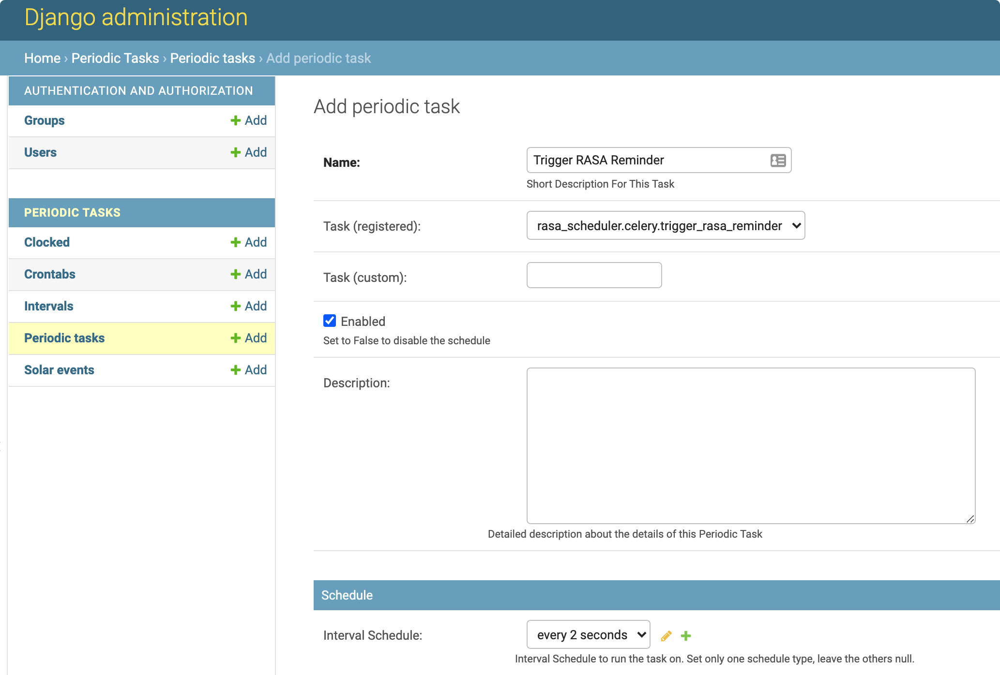

[Celery](https://docs.celeryproject.org/en/stable/) is used to schedule tasks and [Django-celery-beat](https://django-celery-beat.readthedocs.io/en/latest/) for storing and managing periodic tasks.

## How to run

Before starting Celery, make sure you have started RASA:
```
# go to "Rasa_bot"

# start RASA action service
rasa run actions

# start RASA server
rasa run --enable-api
```

Then you can start Celery as following:

1. Create Django super user
`python manage.py createsuperuser`

2. Start the Django admin
`python manage.py runserver`

3. Go to Django admin interface (http://127.0.0.1:8000/admin/) and login
 with the user and password created in step 1

4. Manage periodic tasks in Django amdin, e.g. add, delete or edit tasks.

Add the task `rasa_scheduler.celery.trigger_rasa_reminder` as a periodoc task
as shown in the image below:



Then you can logout.

5. Start Celery

```
# start redis store
docker run -d -p 6379:6379 redis

# start Celery beat
celery -A rasa_scheduler beat -l INFO

# open a new terminal and start Celery worker
celery -A rasa_scheduler worker -l INFO
```

In the Celery worker terminal, you should see something like below:

```
[2021-08-26 09:07:30,549: INFO/MainProcess] Task rasa_scheduler.celery.trigger_rasa_reminder[8b6f744f-9cc9-4f9b-ac96-c67a74b5bb7c] received
[2021-08-26 09:07:30,672: INFO/ForkPoolWorker-7] Task rasa_scheduler.celery.trigger_rasa_reminder[8b6f744f-9cc9-4f9b-ac96-c67a74b5bb7c] succeeded in 0.12206363992299885s: None
```
which means the Celery works successfully!

So the Celery periodically sends a `EXTERNAL_set_reminder` intent to RASA to trigger RASA to set a reminder. This reminder will send a `EXTERNAL_utter_reminder` intent in 2 seconds (it's a setting just for development), and when RASA receives this intent, it will send the reminder message "Voorziet u vandaag risicovolle situaties voor het roken?" to user.


## How to check the reminder?

To see what you can get from the two intents `EXTERNAL_set_reminder` and `EXTERNAL_utter_reminder`, you can send them manually:

1. manually trigger RASA to set a reminder
```
curl -H "Content-Type: application/json" -X POST -d '{"name": "EXTERNAL_set_reminder"}' "http://localhost:5005/conversations/Kees/trigger_intent?output_channel=latest"
```
you should see a response like
```
{"tracker":{"sender_id":"Kees" ... "messages":[{"recipient_id":"Kees","text":"I will remind you in 2 seconds."}]}
```

2. manually trigger RASA to utter reminder message:
```
curl -H "Content-Type: application/json" -X POST -d '{"name": "EXTERNAL_utter_reminder"}' "http://localhost:5005/conversations/Kees/trigger_intent?output_channel=latest"
```
you should see a response like
```
{"tracker":{"sender_id":"Kees" ... "messages":[{"recipient_id":"AAA","text":"Voorziet u vandaag risicovolle situaties voor het roken?"}]}
```
